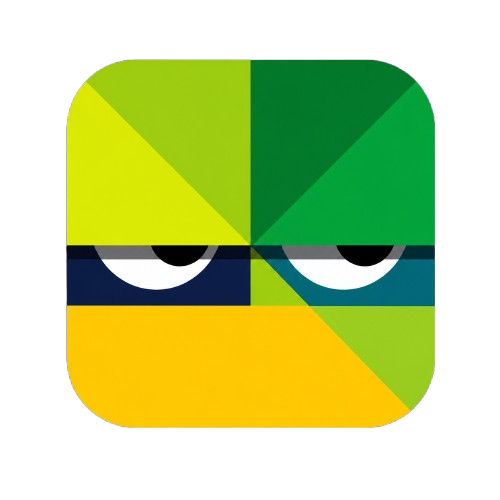

<p align="center">
  
</p>

<h1 align="center">Impostor Bíblico</h1>

<p align="center">
  Un juego bíblico para descubrir al impostor entre tus amigos.<br />
  Recibe tu personaje, comparte pistas y desenmascara a quien no pertenece a la historia.
</p>

<p align="center">
  
  
  
  
</p>

---

## 📖 Descripción

**Impostor Bíblico** es una aplicación web (PWA) inspirada en los juegos de "encuentra al impostor", pero con temática bíblica. Todos los jugadores reciben una palabra o personaje relacionado con la Biblia… excepto el impostor. A través de pistas, los participantes deben descubrir quién no encaja en la historia.

## ✨ Características

- 🎭 Modo **Offline** — todos juegan en el mismo dispositivo.
- 🌍 Modo **Online** — juega con amigos o con el mundo *(próximamente)*.
- 📚 Varios paquetes temáticos: General, Milagros, Personajes Bíblicos, Mujeres de la Biblia, Historias y Vida de Jesús.
- ⚙️ Configuración del juego: número de jugadores, impostores, pistas, rondas y tiempo.
- 📱 **Instalable** como PWA y con soporte offline.
- 🎨 Interfaz moderna, responsiva y en modo oscuro.

## 🚀 Cómo usar

1. Clona el repositorio:
   ```bash
   git clone https://github.com/usuario/Impostor.git
   ```
2. Abre `index.html` en tu navegador, o sírvelo desde un servidor local (por ejemplo XAMPP).
3. ¡Pulsa **Comenzar Juego** y a jugar!

## 🗂️ Estructura del proyecto

```
Impostor/
├── index.html          # Pantalla de bienvenida
├── manifest.json       # Configuración de la PWA
├── sw.js               # Service Worker (offline / caché)
├── css/                # Estilos
├── js/                 # Lógica de las pantallas
├── html/               # Vistas (game, config-game, add-players)
├── icons/              # Íconos de la PWA
└── img/                # Recursos gráficos (logo)
```

## 🛠️ Tecnologías

- HTML5, CSS3 y JavaScript (sin frameworks)
- Progressive Web App (manifest + service worker)
- Íconos vectoriales (SVG)

---

<p align="center">
  Hecho con ❤️ para compartir la Palabra jugando.
</p>
